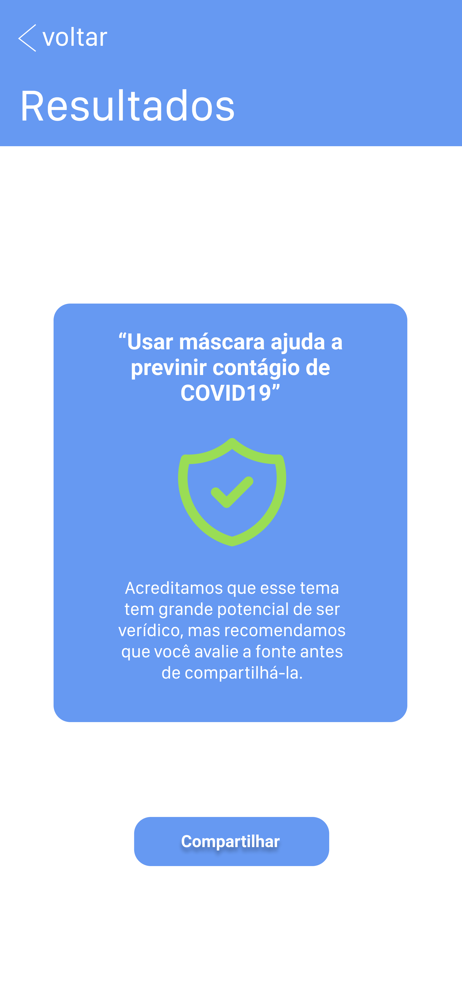
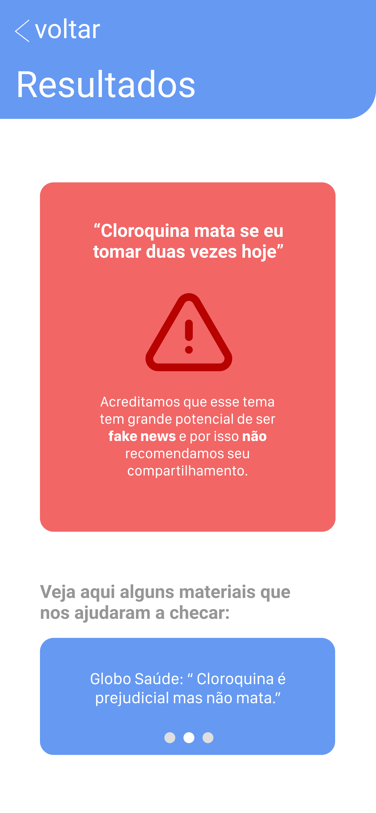

[![Contributors][contributors-shield]][contributors-url]
[![Commits][commits-shield]][commits-url]
[![Forks][forks-shield]][forks-url]
[![Stargazers][stars-shield]][stars-url]
[![Issues][issues-shield]][issues-url]

<!-- PROJECT LOGO -->
 

  

  <h3 align="center">OuviFalar</h3>

  

    O OuviFalar é uma ferramenta simples e amigável para detecção de fake news na área da saúde 
     
    <a href="https://github.com/DaniloLira/TeamGC"><strong>Explore a documentação »</strong></a>
     
     
    <a href="https://github.com/DaniloLira/TeamGC">TestFlight</a>
    ·
    <a href="https://github.com/DaniloLira/TeamGC">Reporte Bug</a>
  

<!-- TABLE OF CONTENTS -->
## Tabela de conteúdo

* [Sobre o projeto](#sobre-o-projeto)
* [Tecnologias utilizadas](#tecnologias-utilizadas)

<!-- ABOUT THE PROJECT -->
## Sobre o projeto
O OuviFalar é um aplicativo iOS desenvolvido durante o Visagio Hackathon 2020.2 voltado para solução de fake news na área de saúde. A aplicação utiliza um modelo de inteligência artificial criado utilizando o CoreML e preenchido com tweets contendo fake news e notícias verdadeiras relacionadas a situação da pandemia do coronavírus. O usuário pode compartilhar alguma notícia recebida em qualquer plataforma (Whatsapp, telegram...) com o aplicativo e ele retornará se aquilo se parece com uma fake news.

| Inicial | Verdadeira | Falsa |
|----------|----------|----------|
|   |    |    |

### Tecnologias utilizadas
Aqui listamos as tecnologias utilizadas para a construção deste projeto
* [Swift](https://swift.org/)
* [CoreML](https://developer.apple.com/documentation/coreml)

<!-- MARKDOWN LINKS & IMAGES -->
<!-- https://www.markdownguide.org/basic-syntax/#reference-style-links -->
[contributors-shield]: https://img.shields.io/github/contributors/DaniloLira/TeamGC.svg?style=flat-square
[contributors-url]: https://img.shields.io/github/contributors/DaniloLira/TeamGC
[forks-shield]: https://img.shields.io/github/forks/DaniloLira/TeamGC.svg?style=flat-square
[forks-url]: https://img.shields.io/github/forks/DaniloLira/TeamGC
[commits-shield]: https://img.shields.io/github/last-commit/DaniloLira/TeamGC.svg?style=flat-square
[commits-url]: https://img.shields.io/github/last-commit/DaniloLira/TeamGCd
[stars-shield]: https://img.shields.io/github/stars/DaniloLira/TeamGC.svg?style=flat-square
[stars-url]: https://img.shields.io/github/stars/DaniloLira/TeamGC
[issues-shield]: https://img.shields.io/github/issues/DaniloLira/TeamGC.svg?style=flat-square
[issues-url]: https://img.shields.io/github/issues/DaniloLira/TeamGC
[product-screenshot]: images/screenshot.png
